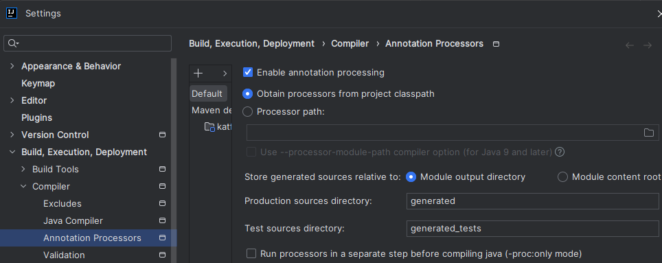

# Micro demo for Kotlin + JUnit5 + Cucumber setup

### Versions used:

| Artifact | Version |
|----------|---------|
| JDK      | 21      |
| Kotlin   | 1.9.23  |
| JUnit    | 5.10.2  |
| Cucumber | 7.16.1  |

### NOTE
Enable annotation processing in IntellIJ
